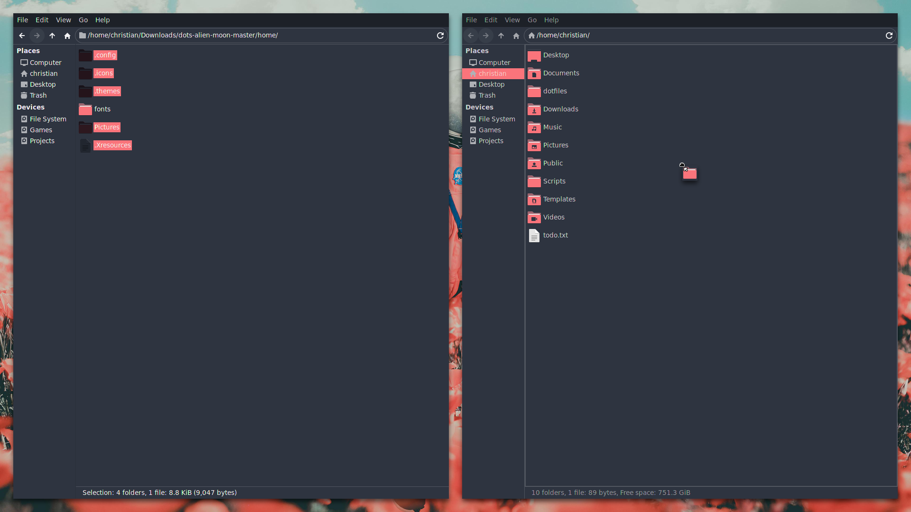
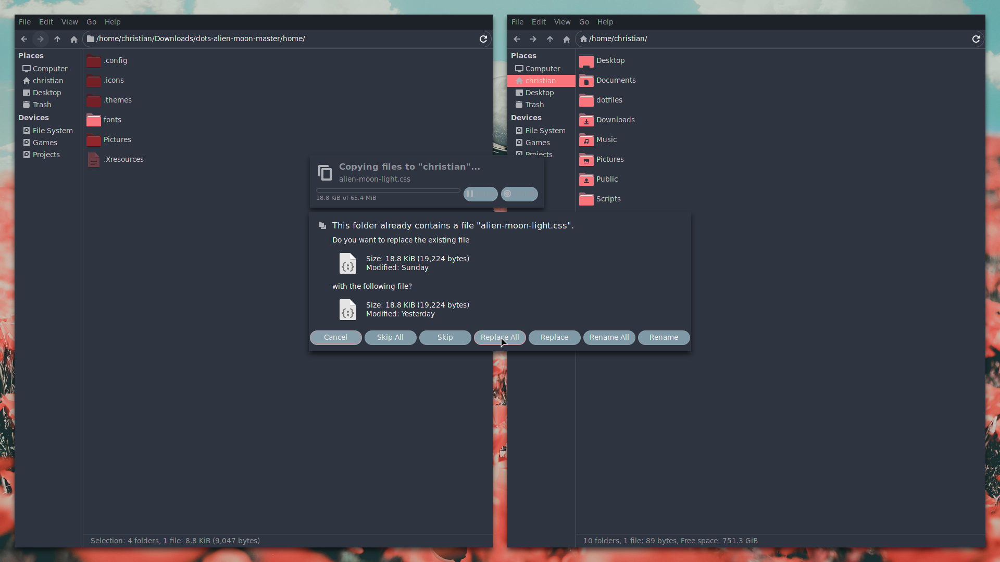
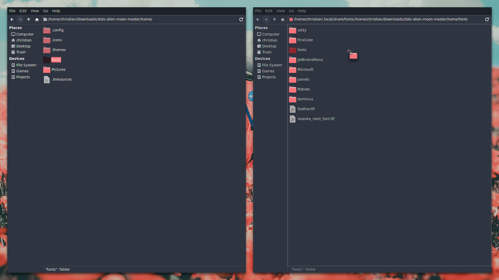
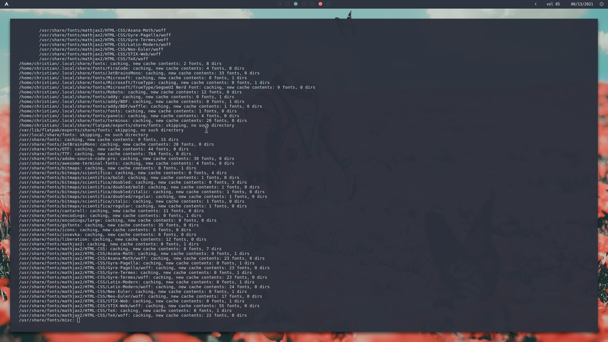

 **LetsHaveKiddos** | **Installation Guide**
===========================

First time writing this kind of guide I'm gonna make it as simple as possible to limit the amount of questions asked, that said I'm genuinely the worst candidate to explain how anything works. So bare with me.

Things you will need:
===========================

* [Timeshift](https://github.com/teejee2008/timeshift) | Or any tool for making backups I prefer Timeshift.

Should be available from your package manager.

* A couple of dependencies.

* A little patience.

Dependencies
===========================

Assuming you know how to use your package manager. apt-get yay pacman etc.

You'll want to download and install these dependencies they're quite popular and very customizable so feel free to give my dots a good editor or two if you'd like but for now

* Kitty

* Dunst (Solid notification daemon, highly customizable.)

* polybar-git

* BetterDiscord

**(optional)** (only necessary if you want to use the custom css for discord.)

* betterlockscreen

* i3lock-color or i3lock-fancy

* i3-gaps

**(technically you can use these files, this theme on most desktop environments, window managers you want, but this guide is for my setup specifically)**

* rofi

* picom-ibhagwan-git

Backup
===========================

This part is technically optional, but seriously recommended if youre prone to screwing something up.

I use Timeshift and I think it's safe to say it's highly recommeneded.

It's already in whatever package manager you're using so just sudo apt-get timeshift, or yay timeshift or pacman -S timeshift, or whatever package manager youre using. Just get Timeshift installed.

Here's a guide if you're unsure how to use Timeshift.  

https://ostechnix.com/how-to-backup-and-restore-linux-system-with-timeshift/

Drag and drop
===========================

PLEASE PROCEED **ONLY** AFTER MAKING A **BACKUP**.

**Leave out the fonts folder, we will deal with them later.**

**You want to copy the following:**

* .config

* .icons

* .themes

* Pictures

Paste into your home folder.

It will overrite some files so when it asks to replace just click "replace all" or "yes to all" or whatever prompt comes your way.

Just a reminder your home folder is /home/"your name"/ not just /home/

In my case it is /home/christian/

Installing Fonts
===========================

Now back to the fonts. Back in the zip, copy the fonts folder into .local/share/fonts

After installing copying the "fonts" folder to .local/share/fonts/

Open up yourself a terminal (kitty preferably)

Run this command to rebuild your font cache.

`fc-cache -f -v`

It will look something like this. 

Finished
===========================

After that, should be it. Logout log back in (if youre using a login manager) switch to i3 and boom you're set. 

If you are curious about short cuts for my config just open (with any editor of your choosing) ~/.config/i3/config

I prettied up my config recently so should be a breeze to go in and out changing whatever you'd like.

